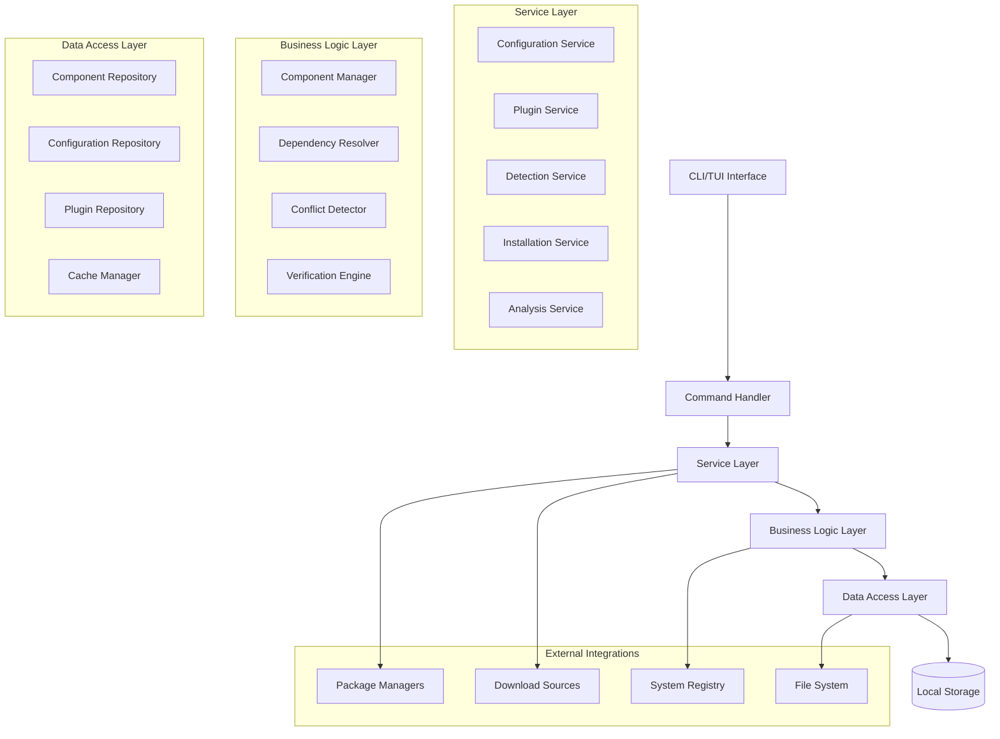
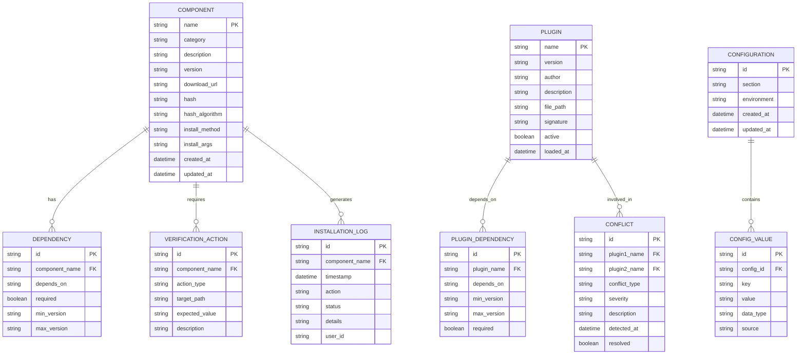

# Arquitetura Técnica - Environment Dev Deep Evaluation

## 1. Arquitetura do Sistema

```mermaid
graph TD
    A[Interface do Usuário] --> B[CLI - Typer]
    A --> C[TUI - Textual]
    
    B --> D[Core System]
    C --> D
    
    D --> E[Configuration Manager]
    D --> F[Plugin System Manager]
    D --> G[Base Classes]
    
    H[Detection Layer] --> I[Unified Detection Engine]
    H --> J[Component Detectors]
    
    K[Analysis Layer] --> L[Architecture Engine]
    K --> M[Gap Analysis Engine]
    K --> N[Requirements Validator]
    
    O[Installation Layer] --> P[Installation Manager]
    O --> Q[Package Managers]
    O --> R[Verification System]
    
    S[Storage Layer] --> T[Intelligent Storage]
    S --> U[Compression Manager]
    S --> V[Distribution Manager]
    
    W[Validation Layer] --> X[Schema Validator]
    W --> Y[Component Validator]
    
    Z[Integration Layer] --> AA[External APIs]
    Z --> BB[System Integration]
    
    CC[Components Database] --> DD[YAML Definitions]
    CC --> EE[Metadata Store]
```



## 2. Descrição Tecnológica

### Frontend
- **CLI**: Typer + Rich para interface de linha de comando moderna
- **TUI**: Textual para interface de terminal interativa
- **Logging**: Rich para saída formatada e colorida

### Backend
- **Core**: Python 3.9+ com arquitetura modular
- **Configuração**: YAML/JSON com validação Pydantic
- **Plugins**: Sistema dinâmico com detecção de conflitos
- **Storage**: Sistema inteligente com compressão

### Dependências Principais
```python
# requirements.txt
typer[all]>=0.9.0
textual>=0.45.0
rich>=13.0.0
pydantic>=2.0.0
PyYAML>=6.0
requests>=2.31.0
psutil>=5.9.0
click>=8.1.0
pytest>=7.4.0
pytest-cov>=4.1.0
sphinx>=7.1.0
```

## 3. Definições de Rotas (CLI)

| Comando | Propósito | Exemplo |
|---------|-----------|----------|
| `mecha init` | Inicialização do sistema | `mecha init --config custom.yaml` |
| `mecha list-components` | Listar componentes disponíveis | `mecha list-components --category "AI Tools"` |
| `mecha install` | Instalar componente específico | `mecha install "Git" --force` |
| `mecha uninstall` | Remover componente | `mecha uninstall "Node.js"` |
| `mecha analyze-gaps` | Análise de lacunas | `mecha analyze-gaps --profile developer` |
| `mecha doctor` | Diagnóstico do sistema | `mecha doctor --verbose` |
| `mecha update` | Atualizar componentes | `mecha update --all` |
| `mecha backup` | Backup de configurações | `mecha backup --path ./backups` |
| `mecha restore` | Restaurar configurações | `mecha restore --file backup.zip` |
| `mecha tui` | Interface TUI | `mecha tui` |

## 4. Definições de API (Interfaces Internas)

### 4.1 Core APIs

#### Configuration Manager
```python
class ConfigurationManager:
    def load_configuration(self, sources: List[str]) -> SystemConfiguration
    def validate_configuration(self, config: SystemConfiguration) -> ValidationResult
    def save_configuration(self, config: SystemConfiguration, path: str) -> bool
    def get_config_value(self, key: str, default: Any = None) -> Any
    def set_config_value(self, key: str, value: Any) -> bool
    def reload_configuration(self) -> bool
```

**Exemplo de Uso**:
```python
config_manager = ConfigurationManager()
config = config_manager.load_configuration(["config.yaml", "env_vars"])

if config_manager.validate_configuration(config).is_valid:
    debug_mode = config_manager.get_config_value("debug_mode", False)
```

#### Plugin System Manager
```python
class PluginSystemManager:
    def load_plugins(self, plugin_dir: str) -> List[Plugin]
    def detect_conflicts(self, plugins: List[Plugin]) -> List[PluginConflict]
    def resolve_conflicts(self, conflicts: List[PluginConflict]) -> ResolutionResult
    def activate_plugin(self, plugin_name: str) -> bool
    def deactivate_plugin(self, plugin_name: str) -> bool
    def get_plugin_info(self, plugin_name: str) -> PluginInfo
```

**Exemplo de Uso**:
```python
plugin_manager = PluginSystemManager()
plugins = plugin_manager.load_plugins("./plugins")
conflicts = plugin_manager.detect_conflicts(plugins)

if conflicts:
    resolution = plugin_manager.resolve_conflicts(conflicts)
    if not resolution.success:
        logger.error(f"Conflitos não resolvidos: {resolution.errors}")
```

### 4.2 Detection APIs

#### Unified Detection Engine
```python
class UnifiedDetectionEngine:
    def detect_installed_components(self) -> List[InstalledComponent]
    def detect_component(self, component_name: str) -> Optional[InstalledComponent]
    def verify_installation(self, component: ComponentDefinition) -> VerificationResult
    def get_component_version(self, component_name: str) -> Optional[str]
    def scan_system_changes(self) -> List[SystemChange]
```

**Request/Response Example**:
```python
# Request
detection_engine = UnifiedDetectionEngine()
components = detection_engine.detect_installed_components()

# Response
[
    InstalledComponent(
        name="Git",
        version="2.43.0",
        install_path="C:\\Program Files\\Git",
        verified=True,
        metadata={"install_date": "2024-01-15", "size_mb": 245}
    ),
    InstalledComponent(
        name="Node.js",
        version="20.10.0",
        install_path="C:\\Program Files\\nodejs",
        verified=True,
        metadata={"install_date": "2024-01-10", "size_mb": 156}
    )
]
```

### 4.3 Analysis APIs

#### Gap Analysis Engine
```python
class GapAnalysisEngine:
    def analyze_gaps(self, profile: str = "default") -> GapAnalysisResult
    def compare_environments(self, env1: str, env2: str) -> ComparisonResult
    def suggest_components(self, use_case: str) -> List[ComponentSuggestion]
    def calculate_dependencies(self, components: List[str]) -> DependencyGraph
```

**Request/Response Example**:
```python
# Request
analyzer = GapAnalysisEngine()
result = analyzer.analyze_gaps(profile="web_developer")

# Response
GapAnalysisResult(
    missing_components=[
        ComponentGap(
            name="Docker Desktop",
            category="Containers",
            priority="high",
            reason="Required for containerized development"
        ),
        ComponentGap(
            name="Postman",
            category="API Tools",
            priority="medium",
            reason="Useful for API testing"
        )
    ],
    outdated_components=[
        OutdatedComponent(
            name="Node.js",
            current_version="18.17.0",
            latest_version="20.10.0",
            update_priority="medium"
        )
    ],
    recommendations=[
        "Consider updating Node.js for security improvements",
        "Install Docker Desktop for container development"
    ]
)
```

### 4.4 Installation APIs

#### Installation Manager
```python
class InstallationManager:
    def install_component(self, component_name: str, options: InstallOptions = None) -> InstallationResult
    def uninstall_component(self, component_name: str) -> UninstallationResult
    def update_component(self, component_name: str) -> UpdateResult
    def batch_install(self, components: List[str]) -> BatchInstallationResult
    def create_backup(self, component_name: str) -> BackupResult
    def rollback_installation(self, component_name: str) -> RollbackResult
```

**Request/Response Example**:
```python
# Request
installer = InstallationManager()
options = InstallOptions(force=True, backup=True, verify_hash=True)
result = installer.install_component("Docker Desktop", options)

# Response
InstallationResult(
    success=True,
    component_name="Docker Desktop",
    version_installed="4.25.2",
    install_path="C:\\Program Files\\Docker\\Docker",
    installation_time=datetime(2024, 1, 15, 14, 30, 0),
    backup_created=True,
    backup_path="./backups/docker_desktop_backup_20240115.zip",
    verification_passed=True,
    logs=[
        "Download iniciado: docker-desktop-installer.exe",
        "Hash verificado: SHA256 match",
        "Backup criado: docker_desktop_backup_20240115.zip",
        "Instalação concluída com sucesso",
        "Verificação pós-instalação: PASSED"
    ]
)
```

## 5. Arquitetura do Servidor (Sistema Local)



## 6. Modelo de Dados

### 6.1 Definição do Modelo de Dados



### 6.2 Definições de Dados (Estruturas Python)

#### Estruturas de Componentes
```python
# models/component.py
from dataclasses import dataclass
from typing import List, Optional, Dict, Any
from datetime import datetime
from enum import Enum

class InstallMethod(Enum):
    EXE = "exe"
    MSI = "msi"
    PIP = "pip"
    NPM = "npm"
    CONDA = "conda"
    CHOCOLATEY = "chocolatey"
    WINGET = "winget"

class ComponentStatus(Enum):
    NOT_INSTALLED = "not_installed"
    INSTALLED = "installed"
    OUTDATED = "outdated"
    CORRUPTED = "corrupted"
    UNKNOWN = "unknown"

@dataclass
class ComponentDefinition:
    """Definição de um componente do sistema"""
    name: str
    category: str
    description: str
    version: Optional[str] = None
    download_url: Optional[str] = None
    hash: Optional[str] = None
    hash_algorithm: str = "sha256"
    install_method: InstallMethod = InstallMethod.EXE
    install_args: Optional[str] = None
    dependencies: List[str] = None
    alternative_urls: List[str] = None
    verify_actions: List[Dict[str, Any]] = None
    metadata: Dict[str, Any] = None
    created_at: datetime = None
    updated_at: datetime = None
    
    def __post_init__(self):
        if self.dependencies is None:
            self.dependencies = []
        if self.alternative_urls is None:
            self.alternative_urls = []
        if self.verify_actions is None:
            self.verify_actions = []
        if self.metadata is None:
            self.metadata = {}
        if self.created_at is None:
            self.created_at = datetime.now()
        if self.updated_at is None:
            self.updated_at = datetime.now()

@dataclass
class InstalledComponent:
    """Componente instalado no sistema"""
    name: str
    version: str
    install_path: str
    status: ComponentStatus
    verified: bool = False
    install_date: Optional[datetime] = None
    size_mb: Optional[float] = None
    metadata: Dict[str, Any] = None
    
    def __post_init__(self):
        if self.metadata is None:
            self.metadata = {}
```

#### Estruturas de Plugins
```python
# models/plugin.py
from dataclasses import dataclass
from typing import List, Optional, Dict, Any
from datetime import datetime
from enum import Enum

class PluginStatus(Enum):
    ACTIVE = "active"
    INACTIVE = "inactive"
    ERROR = "error"
    CONFLICT = "conflict"
    UPDATING = "updating"

class ConflictType(Enum):
    VERSION_INCOMPATIBLE = "version_incompatible"
    DEPENDENCY_CONFLICT = "dependency_conflict"
    RESOURCE_CONFLICT = "resource_conflict"
    API_CONFLICT = "api_conflict"
    RUNTIME_CONFLICT = "runtime_conflict"

@dataclass
class PluginMetadata:
    """Metadados de um plugin"""
    name: str
    version: str
    author: str
    description: str
    file_path: str
    dependencies: List[str] = None
    provides: List[str] = None  # APIs/recursos fornecidos
    requires: List[str] = None  # Recursos necessários
    compatible_versions: List[str] = None
    signature: Optional[str] = None
    checksum: Optional[str] = None
    status: PluginStatus = PluginStatus.INACTIVE
    loaded_at: Optional[datetime] = None
    
    def __post_init__(self):
        if self.dependencies is None:
            self.dependencies = []
        if self.provides is None:
            self.provides = []
        if self.requires is None:
            self.requires = []
        if self.compatible_versions is None:
            self.compatible_versions = []

@dataclass
class PluginConflict:
    """Conflito entre plugins"""
    plugin1: str
    plugin2: str
    conflict_type: ConflictType
    description: str
    severity: str  # "low", "medium", "high", "critical"
    resolution_suggestions: List[str] = None
    detected_at: datetime = None
    resolved: bool = False
    
    def __post_init__(self):
        if self.resolution_suggestions is None:
            self.resolution_suggestions = []
        if self.detected_at is None:
            self.detected_at = datetime.now()
```

#### Estruturas de Configuração
```python
# models/configuration.py
from dataclasses import dataclass, field
from typing import Dict, Any, List, Optional
from datetime import datetime
from pathlib import Path
import os

@dataclass
class SystemConfiguration:
    """Configuração do sistema"""
    # Core settings
    debug_mode: bool = False
    log_level: str = "INFO"
    max_parallel_operations: int = 4
    operation_timeout: int = 300
    
    # Detection settings
    detection_cache_enabled: bool = True
    detection_cache_ttl: int = 3600
    hierarchical_detection_enabled: bool = True
    
    # Download settings
    download_timeout: int = 300
    max_download_retries: int = 3
    parallel_downloads_enabled: bool = True
    hash_verification_required: bool = True
    
    # Installation settings
    automatic_rollback_enabled: bool = True
    backup_before_installation: bool = True
    privilege_escalation_prompt: bool = True
    
    # Plugin settings
    plugin_system_enabled: bool = True
    plugin_signature_verification: bool = True
    plugin_sandboxing_enabled: bool = True
    
    # UI settings
    modern_ui_enabled: bool = True
    real_time_progress: bool = True
    detailed_feedback: bool = True
    
    # Paths
    base_directory: str = field(default_factory=lambda: os.getcwd())
    config_directory: str = field(default_factory=lambda: os.path.join(os.getcwd(), "config"))
    cache_directory: str = field(default_factory=lambda: os.path.join(os.getcwd(), "cache"))
    logs_directory: str = field(default_factory=lambda: os.path.join(os.getcwd(), "logs"))
    downloads_directory: str = field(default_factory=lambda: os.path.join(os.getcwd(), "downloads"))
    temp_directory: str = field(default_factory=lambda: os.path.join(os.getcwd(), "temp"))
    backups_directory: str = field(default_factory=lambda: os.path.join(os.getcwd(), "backups"))
    plugins_directory: str = field(default_factory=lambda: os.path.join(os.getcwd(), "plugins"))
    
    # Runtime detection
    essential_runtimes: List[str] = field(default_factory=lambda: [
        "Git 2.47.1", ".NET SDK 8.0", "Java JDK 21",
        "Visual C++ Redistributables", "Anaconda3",
        ".NET Desktop Runtime 8.0/9.0", "PowerShell 7",
        "Node.js/Python (updated)"
    ])
    
    package_managers: List[str] = field(default_factory=lambda: [
        "npm", "pip", "conda", "yarn", "pipenv"
    ])
    
    # Metadata
    created_at: datetime = field(default_factory=datetime.now)
    updated_at: datetime = field(default_factory=datetime.now)
    version: str = "1.0.0"
```

## 7. Padrões de Implementação

### 7.1 Padrão Repository
```python
# repositories/component_repository.py
from abc import ABC, abstractmethod
from typing import List, Optional
from models.component import ComponentDefinition, InstalledComponent

class ComponentRepositoryInterface(ABC):
    """Interface para repositório de componentes"""
    
    @abstractmethod
    def get_all_components(self) -> List[ComponentDefinition]:
        pass
    
    @abstractmethod
    def get_component_by_name(self, name: str) -> Optional[ComponentDefinition]:
        pass
    
    @abstractmethod
    def get_components_by_category(self, category: str) -> List[ComponentDefinition]:
        pass
    
    @abstractmethod
    def save_component(self, component: ComponentDefinition) -> bool:
        pass
    
    @abstractmethod
    def delete_component(self, name: str) -> bool:
        pass

class YamlComponentRepository(ComponentRepositoryInterface):
    """Implementação do repositório usando arquivos YAML"""
    
    def __init__(self, components_directory: str):
        self.components_directory = Path(components_directory)
    
    def get_all_components(self) -> List[ComponentDefinition]:
        """Carrega todos os componentes dos arquivos YAML"""
        components = []
        
        for yaml_file in self.components_directory.glob("*.yaml"):
            file_components = self._load_components_from_file(yaml_file)
            components.extend(file_components)
        
        return components
    
    def _load_components_from_file(self, file_path: Path) -> List[ComponentDefinition]:
        """Carrega componentes de um arquivo YAML específico"""
        # Implementação da carga de YAML com validação
        pass
```

### 7.2 Padrão Factory
```python
# factories/installer_factory.py
from abc import ABC, abstractmethod
from models.component import ComponentDefinition, InstallMethod
from installers.base import InstallerInterface

class InstallerFactory:
    """Factory para criar instaladores específicos"""
    
    @staticmethod
    def create_installer(component: ComponentDefinition) -> InstallerInterface:
        """Cria instalador apropriado baseado no método de instalação"""
        
        if component.install_method == InstallMethod.EXE:
            from installers.exe_installer import ExeInstaller
            return ExeInstaller(component)
        
        elif component.install_method == InstallMethod.MSI:
            from installers.msi_installer import MsiInstaller
            return MsiInstaller(component)
        
        elif component.install_method == InstallMethod.PIP:
            from installers.pip_installer import PipInstaller
            return PipInstaller(component)
        
        elif component.install_method == InstallMethod.NPM:
            from installers.npm_installer import NpmInstaller
            return NpmInstaller(component)
        
        else:
            raise ValueError(f"Método de instalação não suportado: {component.install_method}")
```

### 7.3 Padrão Observer
```python
# observers/installation_observer.py
from abc import ABC, abstractmethod
from typing import List
from models.component import ComponentDefinition

class InstallationObserver(ABC):
    """Observer para eventos de instalação"""
    
    @abstractmethod
    def on_installation_started(self, component: ComponentDefinition) -> None:
        pass
    
    @abstractmethod
    def on_installation_progress(self, component: ComponentDefinition, progress: float) -> None:
        pass
    
    @abstractmethod
    def on_installation_completed(self, component: ComponentDefinition, success: bool) -> None:
        pass

class InstallationSubject:
    """Subject que notifica observers sobre eventos de instalação"""
    
    def __init__(self):
        self._observers: List[InstallationObserver] = []
    
    def attach(self, observer: InstallationObserver) -> None:
        self._observers.append(observer)
    
    def detach(self, observer: InstallationObserver) -> None:
        self._observers.remove(observer)
    
    def notify_installation_started(self, component: ComponentDefinition) -> None:
        for observer in self._observers:
            observer.on_installation_started(component)
    
    def notify_installation_progress(self, component: ComponentDefinition, progress: float) -> None:
        for observer in self._observers:
            observer.on_installation_progress(component, progress)
    
    def notify_installation_completed(self, component: ComponentDefinition, success: bool) -> None:
        for observer in self._observers:
            observer.on_installation_completed(component, success)
```

## 8. Considerações de Performance

### 8.1 Otimizações de Cache
- **Cache de Detecção**: TTL configurável para resultados de detecção
- **Cache de Downloads**: Armazenamento local de instaladores
- **Cache de Metadados**: Informações de componentes em memória
- **Cache de Configuração**: Configurações carregadas uma vez por sessão

### 8.2 Processamento Paralelo
- **Downloads Paralelos**: Múltiplos downloads simultâneos
- **Detecção Paralela**: Verificação de componentes em threads separadas
- **Análise Assíncrona**: Processamento não-bloqueante de análises
- **Instalação em Lote**: Instalação de múltiplos componentes

### 8.3 Otimização de Memória
- **Lazy Loading**: Carregamento sob demanda de componentes
- **Streaming**: Processamento de arquivos grandes em chunks
- **Garbage Collection**: Limpeza automática de recursos temporários
- **Pool de Objetos**: Reutilização de objetos frequentemente criados

## 9. Segurança e Confiabilidade

### 9.1 Verificação de Integridade
- **Hash SHA256**: Verificação obrigatória de todos os downloads
- **Assinatura Digital**: Validação de plugins críticos
- **Checksum Validation**: Verificação de integridade de arquivos
- **Source Verification**: Validação de fontes de download

### 9.2 Isolamento e Sandboxing
- **Plugin Sandboxing**: Execução isolada de plugins
- **Process Isolation**: Isolamento de processos de instalação
- **Permission Control**: Controle granular de permissões
- **Resource Limits**: Limitação de recursos para operações

### 9.3 Backup e Recuperação
- **Automatic Backup**: Backup automático antes de modificações
- **Rollback Capability**: Capacidade de desfazer instalações
- **State Snapshots**: Snapshots do estado do sistema
- **Recovery Points**: Pontos de recuperação configuráveis

Esta arquitetura técnica fornece uma base sólida para a implementação do plano de aprimoramento, garantindo escalabilidade, manutenibilidade e segurança do sistema Environment Dev Deep Evaluation.