# Plano de Aprimoramento Técnico - Environment Dev Deep Evaluation

## 1. Visão Geral do Projeto

O Environment Dev Deep Evaluation é um sistema avançado de gerenciamento e instalação de ferramentas de desenvolvimento que oferece:

* **Detecção Inteligente**: Identificação automática de ferramentas instaladas no sistema

* **Análise de Lacunas**: Avaliação de dependências e componentes faltantes

* **Instalação Automatizada**: Processo de instalação com verificação de integridade

* **Sistema de Plugins**: Arquitetura extensível com detecção de conflitos

* **Gerenciamento de Configuração**: Sistema centralizado de configurações

### Problemas Identificados

1. **Ausência de Testes Unitários**: Especialmente no módulo `core`, que é fundamental
2. **Hashes Pendentes**: Múltiplos componentes com `HASH_PENDENTE_VERIFICACAO`
3. **Falta de Validação**: Arquivos YAML sem validação de esquema
4. **Interface Limitada**: Ausência de CLI e TUI amigáveis
5. **Documentação Insuficiente**: Falta de guias e documentação da API

## 2. Análise da Arquitetura Atual

### 2.1 Estrutura de Módulos

```mermaid
graph TD
    A[Core] --> B[Configuration Manager]
    A --> C[Plugin System]
    A --> D[Base Classes]
    
    E[Detection] --> F[Unified Engine]
    E --> G[Detection Interfaces]
    
    H[Analysis] --> I[Architecture Engine]
    H --> J[Gap Analysis Engine]
    H --> K[Requirements Validator]
    
    L[Installation] --> M[Installation Interfaces]
    
    N[Storage] --> O[Intelligent Storage Manager]
    N --> P[Compression Manager]
    N --> Q[Distribution Manager]
    
    R[Validation] --> S[Validation Interfaces]
    
    T[Integration] --> U[Integration Interfaces]
    
    V[Components] --> W[YAML Definitions]
```



### 2.2 Pontos Críticos Identificados

#### ConfigurationManager (core/config.py)

* **Responsabilidades**: Carregamento, validação e gerenciamento de configurações

* **Riscos**: Falhas podem comprometer todo o sistema

* **Prioridade de Teste**: CRÍTICA

#### PluginSystemManager (core/plugin\_system.py)

* **Responsabilidades**: Carregamento de plugins, detecção de conflitos

* **Riscos**: Conflitos não detectados podem causar instabilidade

* **Prioridade de Teste**: CRÍTICA

#### Componentes YAML

* **Problema**: Hashes pendentes em múltiplos arquivos

* **Impacto de Segurança**: ALTO

* **Componentes Afetados**:

  * LM Studio: `HASH_NEEDS_UPDATE`

  * NVIDIA CUDA Toolkit: `HASH_PENDENTE_VERIFICACAO`

  * Clang: `HASH_PENDENTE_VERIFICACAO`

  * Git: `HASH_PENDENTE_VERIFICACAO`

## 3. Fase 1: Estabilização e Segurança (Prioridade Máxima)

### 3.1 Implementação de Testes Unitários para o Core

#### Estrutura de Testes Proposta

```
tests/
├── __init__.py
├── core/
│   ├── __init__.py
│   ├── test_config.py
│   ├── test_plugin_system.py
│   ├── test_base.py
│   └── fixtures/
│       ├── test_config.yaml
│       ├── test_config.json
│       └── mock_plugins/
├── integration/
│   ├── test_full_workflow.py
│   └── test_component_loading.py
└── utils/
    ├── test_helpers.py
    └── mock_data.py
```

#### Casos de Teste Críticos

**test\_config.py**:

* Carregamento de configuração de múltiplas fontes

* Validação de configurações inválidas

* Merge de configurações de diferentes origens

* Tratamento de variáveis de ambiente

* Persistência de configurações

**test\_plugin\_system.py**:

* Carregamento de plugins válidos

* Detecção de dependências circulares

* Identificação de conflitos de versão

* Resolução de conflitos de recursos

* Validação de metadados de plugins

### 3.2 Correção de Hashes de Verificação

#### Estratégia de Implementação

1. **Script de Verificação Automática**:

```python
# tools/hash_updater.py
import hashlib
import requests
import yaml
from pathlib import Path

def calculate_file_hash(url: str) -> str:
    """Baixa arquivo e calcula hash SHA256"""
    response = requests.get(url, stream=True)
    sha256_hash = hashlib.sha256()
    
    for chunk in response.iter_content(chunk_size=8192):
        sha256_hash.update(chunk)
    
    return sha256_hash.hexdigest()

def update_component_hashes():
    """Atualiza hashes pendentes em todos os componentes"""
    components_dir = Path("components")
    
    for yaml_file in components_dir.glob("*.yaml"):
        with open(yaml_file, 'r', encoding='utf-8') as f:
            data = yaml.safe_load(f)
        
        updated = False
        for component_name, component_data in data.items():
            if component_data.get('hash') in ['HASH_PENDENTE_VERIFICACAO', 'HASH_NEEDS_UPDATE']:
                url = component_data.get('download_url')
                if url:
                    print(f"Calculando hash para {component_name}...")
                    new_hash = calculate_file_hash(url)
                    component_data['hash'] = new_hash
                    updated = True
        
        if updated:
            with open(yaml_file, 'w', encoding='utf-8') as f:
                yaml.dump(data, f, default_flow_style=False, allow_unicode=True)
```

1. **Processo de Validação**:

   * Verificação automática durante CI/CD

   * Validação de integridade antes da instalação

   * Logs detalhados de verificação

### 3.3 Validação de Esquema para Componentes YAML

#### Esquema Pydantic Proposto

```python
# core/schemas.py
from pydantic import BaseModel, HttpUrl, validator
from typing import List, Optional, Dict, Any
from enum import Enum

class InstallMethod(str, Enum):
    EXE = "exe"
    MSI = "msi"
    PIP = "pip"
    NPM = "npm"
    CONDA = "conda"
    CHOCOLATEY = "chocolatey"
    WINGET = "winget"

class HashAlgorithm(str, Enum):
    SHA256 = "sha256"
    SHA1 = "sha1"
    MD5 = "md5"

class VerifyAction(BaseModel):
    type: str
    path: Optional[str] = None
    name: Optional[str] = None
    description: Optional[str] = None

class ComponentDefinition(BaseModel):
    category: str
    description: str
    install_method: InstallMethod
    download_url: Optional[HttpUrl] = None
    install_args: Optional[str] = None
    hash: str
    hash_algorithm: HashAlgorithm = HashAlgorithm.SHA256
    dependencies: List[str] = []
    alternative_urls: List[HttpUrl] = []
    verify_actions: List[VerifyAction] = []
    
    @validator('hash')
    def validate_hash(cls, v):
        if v in ['HASH_PENDENTE_VERIFICACAO', 'HASH_NEEDS_UPDATE']:
            raise ValueError('Hash deve ser calculado antes da validação')
        return v

class ComponentsFile(BaseModel):
    __root__: Dict[str, ComponentDefinition]
```

#### Integração da Validação

```python
# core/component_loader.py
from .schemas import ComponentsFile
import yaml
from pathlib import Path

class ComponentLoader:
    def load_and_validate_components(self, file_path: Path) -> Dict[str, ComponentDefinition]:
        """Carrega e valida arquivo de componentes"""
        try:
            with open(file_path, 'r', encoding='utf-8') as f:
                raw_data = yaml.safe_load(f)
            
            # Validação usando Pydantic
            validated_data = ComponentsFile(__root__=raw_data)
            return validated_data.__root__
            
        except ValidationError as e:
            raise ComponentValidationError(
                f"Erro de validação em {file_path}: {e}",
                file_path=file_path,
                validation_errors=e.errors()
            )
```

## 4. Fase 2: Melhoria da Experiência do Usuário

### 4.1 Interface de Linha de Comando (CLI)

#### Estrutura CLI com Typer

```python
# cli/main.py
import typer
from rich.console import Console
from rich.table import Table
from typing import Optional

app = typer.Typer(name="mecha", help="Environment Dev Deep Evaluation CLI")
console = Console()

@app.command()
def init(
    config_path: Optional[str] = typer.Option(None, "--config", "-c", help="Caminho para arquivo de configuração")
):
    """Inicializa configuração do sistema"""
    console.print("[green]Inicializando Environment Dev Deep Evaluation...[/green]")
    # Implementação da inicialização

@app.command()
def list_components(
    category: Optional[str] = typer.Option(None, "--category", "-c", help="Filtrar por categoria")
):
    """Lista todos os componentes disponíveis"""
    table = Table(title="Componentes Disponíveis")
    table.add_column("Nome", style="cyan")
    table.add_column("Categoria", style="magenta")
    table.add_column("Descrição", style="green")
    table.add_column("Status", style="yellow")
    
    # Implementação da listagem
    console.print(table)

@app.command()
def install(
    component: str = typer.Argument(..., help="Nome do componente para instalar"),
    force: bool = typer.Option(False, "--force", "-f", help="Forçar reinstalação")
):
    """Instala um componente específico"""
    with console.status(f"[bold green]Instalando {component}..."):
        # Implementação da instalação
        pass

@app.command()
def analyze_gaps():
    """Executa análise de lacunas do ambiente"""
    console.print("[blue]Executando análise de lacunas...[/blue]")
    # Implementação da análise

@app.command()
def doctor():
    """Verifica saúde do ambiente e configuração"""
    console.print("[yellow]Executando diagnóstico do sistema...[/yellow]")
    # Implementação do diagnóstico

if __name__ == "__main__":
    app()
```

### 4.2 Interface de Usuário no Terminal (TUI)

#### Estrutura TUI com Textual

```python
# tui/main.py
from textual.app import App, ComposeResult
from textual.containers import Container, Horizontal, Vertical
from textual.widgets import (
    Header, Footer, DataTable, ProgressBar, 
    Log, Button, Static, Tree
)
from textual.reactive import reactive

class EnvironmentDevTUI(App):
    """Interface TUI principal"""
    
    CSS_PATH = "tui.css"
    TITLE = "Environment Dev Deep Evaluation"
    
    show_tree = reactive(True)
    
    def compose(self) -> ComposeResult:
        """Compõe a interface"""
        yield Header()
        
        with Container(id="app-grid"):
            with Vertical(id="left-panel"):
                yield Static("Componentes", id="components-title")
                yield DataTable(id="components-table")
                
            with Vertical(id="right-panel"):
                yield Static("Progresso", id="progress-title")
                yield ProgressBar(id="main-progress")
                yield Log(id="operation-log")
                
            with Horizontal(id="bottom-panel"):
                yield Button("Instalar Selecionados", id="install-btn")
                yield Button("Analisar Lacunas", id="analyze-btn")
                yield Button("Diagnóstico", id="doctor-btn")
        
        yield Footer()
    
    def on_mount(self) -> None:
        """Inicialização da interface"""
        self.load_components()
    
    def load_components(self) -> None:
        """Carrega lista de componentes"""
        table = self.query_one("#components-table", DataTable)
        table.add_columns("Nome", "Categoria", "Status", "Versão")
        
        # Carregar dados dos componentes
        # Implementação da carga de dados
    
    def on_button_pressed(self, event: Button.Pressed) -> None:
        """Manipula cliques em botões"""
        if event.button.id == "install-btn":
            self.install_selected_components()
        elif event.button.id == "analyze-btn":
            self.analyze_gaps()
        elif event.button.id == "doctor-btn":
            self.run_doctor()
```

## 5. Fase 3: Expansão e Robustez

### 5.1 Estratégia de Testes Expandida

#### Testes de Integração

```python
# tests/integration/test_full_workflow.py
import pytest
from pathlib import Path
from unittest.mock import Mock, patch

class TestFullWorkflow:
    """Testes de fluxo completo do sistema"""
    
    def test_detection_to_installation_workflow(self):
        """Testa fluxo: detecção -> análise -> instalação -> validação"""
        # 1. Detecção
        detector = UnifiedDetectionEngine()
        detected_components = detector.detect_installed_components()
        
        # 2. Análise de lacunas
        analyzer = GapAnalysisEngine()
        gaps = analyzer.analyze_gaps(detected_components)
        
        # 3. Instalação de componentes faltantes
        installer = InstallationManager()
        for gap in gaps:
            result = installer.install_component(gap.component_name)
            assert result.success
        
        # 4. Validação pós-instalação
        validator = ComponentValidator()
        for gap in gaps:
            is_valid = validator.validate_installation(gap.component_name)
            assert is_valid
    
    def test_plugin_conflict_resolution(self):
        """Testa resolução de conflitos de plugins"""
        plugin_manager = PluginSystemManager()
        
        # Simular plugins conflitantes
        conflicting_plugins = [
            create_mock_plugin("plugin_a", provides=["api_v1"]),
            create_mock_plugin("plugin_b", provides=["api_v1"])
        ]
        
        conflicts = plugin_manager.detect_conflicts(conflicting_plugins)
        assert len(conflicts) > 0
        
        # Testar resolução
        resolution = plugin_manager.resolve_conflicts(conflicts)
        assert resolution.success
```

#### Cobertura de Testes por Módulo

| Módulo       | Cobertura Alvo | Testes Críticos                      |
| ------------ | -------------- | ------------------------------------ |
| core         | 95%            | ConfigurationManager, PluginSystem   |
| detection    | 85%            | UnifiedEngine, ComponentDetection    |
| analysis     | 85%            | GapAnalysis, ArchitectureEngine      |
| installation | 90%            | InstallationManager, Verification    |
| storage      | 80%            | IntelligentStorage, Compression      |
| validation   | 85%            | ComponentValidator, SchemaValidation |

### 5.2 Documentação Abrangente

#### Estrutura de Documentação

```
docs/
├── index.md
├── getting-started/
│   ├── installation.md
│   ├── quick-start.md
│   └── configuration.md
├── user-guide/
│   ├── cli-reference.md
│   ├── tui-guide.md
│   ├── component-management.md
│   └── troubleshooting.md
├── developer-guide/
│   ├── architecture.md
│   ├── plugin-development.md
│   ├── component-creation.md
│   └── contributing.md
├── api-reference/
│   ├── core.md
│   ├── detection.md
│   ├── analysis.md
│   └── installation.md
└── examples/
    ├── custom-components.md
    ├── plugin-examples.md
    └── integration-examples.md
```

#### README.md Estruturado

````markdown
# Environment Dev Deep Evaluation

> Sistema avançado de gerenciamento e instalação de ferramentas de desenvolvimento

## 🚀 Características Principais

- **Detecção Inteligente**: Identifica automaticamente ferramentas instaladas
- **Análise de Lacunas**: Avalia dependências e componentes faltantes
- **Instalação Segura**: Verificação de integridade com hashes SHA256
- **Sistema de Plugins**: Arquitetura extensível com detecção de conflitos
- **Interface Moderna**: CLI e TUI intuitivas

## 📦 Instalação

```bash
# Clonagem do repositório
git clone https://github.com/user/environment-dev-deep-evaluation.git
cd environment-dev-deep-evaluation

# Instalação de dependências
pip install -r requirements.txt

# Inicialização
python -m mecha init
````

## 🎯 Uso Rápido

```bash
# Listar componentes disponíveis
mecha list-components

# Instalar componente específico
mecha install "Git"

# Análise de lacunas
mecha analyze-gaps

# Diagnóstico do sistema
mecha doctor

# Interface TUI
mecha tui
```

```

## 6. Cronograma de Implementação

### Sprint 1 (Semanas 1-2): Estabilização
- [ ] Implementar testes unitários para ConfigurationManager
- [ ] Implementar testes unitários para PluginSystemManager
- [ ] Criar script de atualização de hashes
- [ ] Atualizar todos os hashes pendentes

### Sprint 2 (Semanas 3-4): Validação
- [ ] Implementar esquemas Pydantic
- [ ] Integrar validação no carregamento de componentes
- [ ] Criar testes para validação de esquemas
- [ ] Documentar estrutura de componentes

### Sprint 3 (Semanas 5-6): CLI
- [ ] Implementar CLI básica com Typer
- [ ] Comandos: init, list-components, install
- [ ] Comandos: analyze-gaps, doctor
- [ ] Testes para CLI

### Sprint 4 (Semanas 7-8): TUI
- [ ] Implementar TUI com Textual
- [ ] Interface de seleção de componentes
- [ ] Barras de progresso e logs em tempo real
- [ ] Integração com CLI

### Sprint 5 (Semanas 9-10): Testes e Documentação
- [ ] Testes de integração
- [ ] Expansão da cobertura de testes
- [ ] Documentação completa
- [ ] Guias de contribuição

## 7. Métricas de Sucesso

### Qualidade de Código
- **Cobertura de Testes**: > 85% para módulos críticos
- **Complexidade Ciclomática**: < 10 para funções críticas
- **Duplicação de Código**: < 5%
- **Vulnerabilidades de Segurança**: 0 críticas

### Experiência do Usuário
- **Tempo de Instalação**: < 30 segundos por componente
- **Taxa de Sucesso**: > 95% para instalações
- **Feedback do Usuário**: > 4.5/5 em usabilidade
- **Documentação**: 100% dos recursos documentados

### Robustez do Sistema
- **Detecção de Conflitos**: 100% de conflitos conhecidos
- **Recuperação de Erros**: < 5 segundos para rollback
- **Compatibilidade**: Suporte a Windows 10/11
- **Performance**: < 2 segundos para análise de lacunas

## 8. Considerações de Segurança

### Verificação de Integridade
- Todos os downloads verificados com SHA256
- Assinatura digital para plugins críticos
- Sandbox para execução de plugins
- Logs de auditoria para todas as operações

### Controle de Acesso
- Elevação de privilégios apenas quando necessário
- Confirmação do usuário para operações críticas
- Isolamento de processos de instalação
- Backup automático antes de modificações

## 9. Conclusão

Este plano de aprimoramento aborda sistematicamente as fragilidades identificadas no Environment Dev Deep Evaluation, priorizando:

1. **Estabilização**: Testes unitários e correção de hashes
2. **Segurança**: Validação de esquemas e verificação de integridade
3. **Usabilidade**: CLI e TUI modernas e intuitivas
4. **Sustentabilidade**: Documentação abrangente e testes expandidos

A implementação seguirá uma abordagem incremental, garantindo que cada fase seja completamente validada antes de prosseguir para a próxima, resultando em um sistema robusto, seguro e fácil de usar.
```

