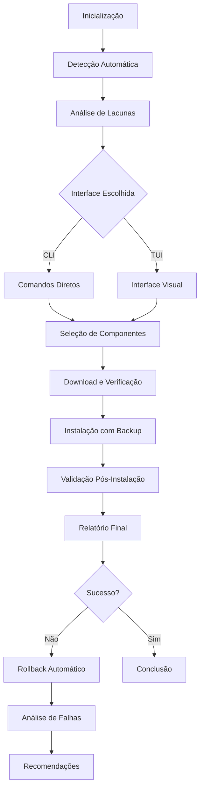

# Documento de Requisitos de Produto - Environment Dev Deep Evaluation

## 1. Visão Geral do Produto

O Environment Dev Deep Evaluation é uma solução abrangente para automação e gerenciamento de ambientes de desenvolvimento, oferecendo detecção inteligente, análise de lacunas e instalação automatizada de ferramentas essenciais. O sistema resolve o problema de configuração manual e propensa a erros de ambientes de desenvolvimento, proporcionando uma experiência consistente e confiável para desenvolvedores e equipes de TI.

O produto visa reduzir o tempo de configuração de ambientes de desenvolvimento de horas para minutos, garantindo consistência entre diferentes máquinas e projetos.

## 2. Funcionalidades Principais

### 2.1 Papéis de Usuário

| Papel | Método de Registro | Permissões Principais |
|-------|-------------------|----------------------|
| Desenvolvedor Individual | Instalação local | Pode detectar, analisar e instalar componentes em sua máquina |
| Administrador de TI | Configuração de perfil admin | Pode criar perfis personalizados, gerenciar políticas de instalação e monitorar múltiplas máquinas |
| Líder Técnico | Elevação de privilégios | Pode definir padrões de equipe, criar templates de ambiente e aprovar instalações críticas |

### 2.2 Módulos de Funcionalidade

Nossos requisitos consistem nas seguintes páginas principais:

1. **Interface CLI**: comandos de linha para automação, execução de scripts, análise rápida
2. **Interface TUI**: interface visual no terminal, seleção interativa de componentes, monitoramento em tempo real
3. **Sistema de Detecção**: varredura automática do sistema, identificação de componentes instalados, verificação de versões
4. **Motor de Análise**: análise de lacunas, recomendações inteligentes, comparação de ambientes
5. **Sistema de Instalação**: download seguro, instalação automatizada, verificação de integridade
6. **Gerenciamento de Plugins**: carregamento dinâmico, detecção de conflitos, resolução automática

### 2.3 Detalhes das Páginas

| Nome da Página | Nome do Módulo | Descrição da Funcionalidade |
|----------------|----------------|-----------------------------|
| Interface CLI | Sistema de Comandos | Executar comandos como `mecha init`, `mecha install`, `mecha analyze-gaps`. Suportar flags e opções avançadas. Fornecer saída formatada e logs detalhados |
| Interface TUI | Interface Visual | Exibir lista navegável de componentes com filtros por categoria. Mostrar barras de progresso em tempo real. Apresentar logs de operação em painel dedicado |
| Sistema de Detecção | Motor de Varredura | Detectar automaticamente ferramentas instaladas no sistema. Verificar versões e status de instalação. Identificar dependências e conflitos potenciais |
| Motor de Análise | Análise Inteligente | Comparar ambiente atual com perfis predefinidos. Identificar componentes faltantes ou desatualizados. Gerar recomendações baseadas em casos de uso |
| Sistema de Instalação | Gerenciador de Instalação | Baixar componentes de fontes verificadas. Verificar hashes SHA256 antes da instalação. Executar instalação com backup automático e rollback |
| Gerenciamento de Plugins | Sistema de Plugins | Carregar plugins dinamicamente do diretório configurado. Detectar conflitos de versão e recursos. Resolver dependências automaticamente |
| Configuração | Gerenciador de Config | Carregar configurações de múltiplas fontes (YAML, JSON, env vars). Validar configurações usando esquemas Pydantic. Permitir override de configurações por usuário |
| Validação | Sistema de Verificação | Validar integridade de componentes instalados. Verificar dependências e compatibilidade. Executar testes de funcionamento pós-instalação |

## 3. Processo Principal

### Fluxo do Desenvolvedor Individual
1. **Inicialização**: Usuário executa `mecha init` para configurar o sistema
2. **Detecção**: Sistema detecta automaticamente componentes já instalados
3. **Análise**: Usuário executa `mecha analyze-gaps` para identificar lacunas
4. **Seleção**: Usuário escolhe componentes para instalar via CLI ou TUI
5. **Instalação**: Sistema baixa, verifica e instala componentes selecionados
6. **Validação**: Sistema verifica se instalações foram bem-sucedidas
7. **Relatório**: Usuário recebe relatório final com status de todas as operações

### Fluxo do Administrador de TI
1. **Configuração de Perfis**: Admin cria perfis personalizados para diferentes tipos de desenvolvimento
2. **Definição de Políticas**: Admin configura políticas de segurança e aprovação
3. **Distribuição**: Admin distribui configurações para equipes
4. **Monitoramento**: Admin monitora instalações e compliance através de relatórios
5. **Manutenção**: Admin atualiza perfis e componentes conforme necessário

## 4. Design da Interface do Usuário

### 4.1 Estilo de Design

- **Cores Primárias**: 
  - Azul principal: `#2563eb` (para elementos de ação)
  - Verde sucesso: `#10b981` (para status positivos)
  - Vermelho erro: `#ef4444` (para alertas e erros)
  - Amarelo aviso: `#f59e0b` (para avisos e pendências)
- **Cores Secundárias**:
  - Cinza texto: `#374151` (para texto principal)
  - Cinza claro: `#f3f4f6` (para backgrounds)
  - Branco: `#ffffff` (para cards e containers)
- **Estilo de Botões**: Bordas arredondadas (8px), sombras sutis, estados hover bem definidos
- **Fontes**: 
  - Primária: `Consolas, 'Courier New', monospace` (para CLI/TUI)
  - Secundária: `'Segoe UI', Tahoma, Geneva, Verdana, sans-serif` (para documentação)
  - Tamanhos: 12px (pequeno), 14px (normal), 16px (títulos), 18px (cabeçalhos)
- **Layout**: Design baseado em cards para TUI, layout em colunas para informações, navegação por tabs
- **Ícones**: Estilo minimalista, uso de símbolos Unicode e caracteres especiais para compatibilidade com terminal

### 4.2 Visão Geral do Design das Páginas

| Nome da Página | Nome do Módulo | Elementos da UI |
|----------------|----------------|----------------|
| Interface CLI | Sistema de Comandos | Prompt colorido com indicadores de status. Saída formatada com Rich (tabelas, barras de progresso, texto colorido). Mensagens de erro destacadas em vermelho. Logs estruturados com timestamps |
| Interface TUI | Painel Principal | Header com título e status do sistema. Sidebar com categorias de componentes. Área principal com tabela de componentes (nome, versão, status). Footer com ações disponíveis e atalhos de teclado |
| Interface TUI | Painel de Progresso | Barra de progresso principal no topo. Lista de tarefas em andamento com status individual. Log em tempo real com scroll automático. Botões de controle (pausar, cancelar, detalhes) |
| Interface TUI | Painel de Configuração | Formulário estruturado com seções colapsáveis. Campos de entrada com validação em tempo real. Preview das configurações antes de aplicar. Botões de salvar, cancelar e restaurar padrões |
| Interface TUI | Painel de Relatórios | Resumo executivo com métricas principais. Gráficos ASCII para visualização de dados. Lista detalhada de componentes com filtros. Opções de exportação (JSON, YAML, texto) |

### 4.3 Responsividade

O produto é projetado para ambientes de terminal e linha de comando, com adaptação automática ao tamanho da janela do terminal. A interface TUI se ajusta dinamicamente a diferentes resoluções de terminal (mínimo 80x24, recomendado 120x30). Suporte para redimensionamento em tempo real e layouts flexíveis que se adaptam ao espaço disponível.

## 5. Requisitos Funcionais Detalhados

### 5.1 Sistema de Detecção

**RF001 - Detecção Automática de Componentes**
- O sistema deve detectar automaticamente ferramentas de desenvolvimento instaladas
- Deve identificar versões específicas de cada componente
- Deve verificar integridade e funcionalidade dos componentes detectados
- Tempo de execução máximo: 30 segundos para varredura completa

**RF002 - Cache de Detecção**
- O sistema deve manter cache dos resultados de detecção
- Cache deve ter TTL configurável (padrão: 1 hora)
- Deve permitir invalidação manual do cache
- Deve detectar mudanças no sistema e invalidar cache automaticamente

### 5.2 Sistema de Análise

**RF003 - Análise de Lacunas**
- O sistema deve comparar ambiente atual com perfis predefinidos
- Deve identificar componentes faltantes, desatualizados ou incompatíveis
- Deve gerar recomendações priorizadas por importância
- Deve suportar perfis personalizados (web dev, mobile dev, data science, etc.)

**RF004 - Análise de Dependências**
- O sistema deve mapear dependências entre componentes
- Deve detectar dependências circulares
- Deve resolver ordem de instalação automaticamente
- Deve alertar sobre conflitos de versão

### 5.3 Sistema de Instalação

**RF005 - Download Seguro**
- O sistema deve verificar hashes SHA256 de todos os downloads
- Deve suportar múltiplas fontes de download com fallback
- Deve implementar retry automático com backoff exponencial
- Deve suportar downloads paralelos com limite configurável

**RF006 - Instalação Automatizada**
- O sistema deve suportar múltiplos métodos de instalação (EXE, MSI, PIP, NPM, etc.)
- Deve criar backup automático antes de instalações críticas
- Deve implementar rollback automático em caso de falha
- Deve executar verificação pós-instalação

### 5.4 Sistema de Plugins

**RF007 - Carregamento Dinâmico**
- O sistema deve carregar plugins dinamicamente do diretório configurado
- Deve validar assinatura digital de plugins críticos
- Deve executar plugins em ambiente isolado (sandboxing)
- Deve permitir ativação/desativação de plugins em tempo de execução

**RF008 - Detecção de Conflitos**
- O sistema deve detectar conflitos entre plugins automaticamente
- Deve classificar conflitos por severidade (baixa, média, alta, crítica)
- Deve sugerir resoluções para conflitos detectados
- Deve permitir resolução manual de conflitos

### 5.5 Interface de Usuário

**RF009 - Interface CLI**
- O sistema deve fornecer CLI completa com todos os comandos principais
- Deve suportar autocompletar para comandos e parâmetros
- Deve fornecer help contextual para todos os comandos
- Deve suportar execução em modo batch/script

**RF010 - Interface TUI**
- O sistema deve fornecer TUI interativa para operações visuais
- Deve suportar navegação por teclado e mouse (quando disponível)
- Deve mostrar progresso em tempo real para operações longas
- Deve permitir operações paralelas com múltiplas janelas

## 6. Requisitos Não-Funcionais

### 6.1 Performance

**RNF001 - Tempo de Resposta**
- Detecção de componentes: máximo 30 segundos
- Análise de lacunas: máximo 10 segundos
- Inicialização da interface: máximo 3 segundos
- Resposta a comandos CLI: máximo 1 segundo

**RNF002 - Throughput**
- Suporte a downloads paralelos (máximo 4 simultâneos)
- Processamento de até 100 componentes por análise
- Suporte a até 50 plugins carregados simultaneamente

### 6.2 Confiabilidade

**RNF003 - Disponibilidade**
- Sistema deve funcionar offline para operações básicas
- Deve manter funcionalidade mesmo com falhas de rede temporárias
- Deve recuperar automaticamente de falhas não-críticas

**RNF004 - Integridade**
- Verificação obrigatória de hashes para todos os downloads
- Backup automático antes de modificações críticas
- Logs detalhados de todas as operações para auditoria

### 6.3 Usabilidade

**RNF005 - Facilidade de Uso**
- Interface intuitiva que não requer treinamento extensivo
- Mensagens de erro claras e acionáveis
- Documentação contextual integrada
- Suporte a múltiplos idiomas (inicialmente português e inglês)

**RNF006 - Acessibilidade**
- Compatibilidade com leitores de tela
- Suporte a navegação apenas por teclado
- Contraste adequado para visibilidade
- Textos redimensionáveis

### 6.4 Segurança

**RNF007 - Autenticação e Autorização**
- Controle de acesso baseado em perfis de usuário
- Elevação de privilégios apenas quando necessário
- Logs de auditoria para operações sensíveis

**RNF008 - Proteção de Dados**
- Criptografia de dados sensíveis em repouso
- Comunicação segura para downloads (HTTPS obrigatório)
- Isolamento de processos para operações críticas

### 6.5 Compatibilidade

**RNF009 - Plataformas Suportadas**
- Windows 10 (versão 1909 ou superior)
- Windows 11 (todas as versões)
- Suporte futuro para Windows Server 2019/2022

**RNF010 - Dependências**
- Python 3.9 ou superior
- Mínimo 4GB RAM disponível
- 10GB espaço em disco para cache e downloads
- Conexão com internet para downloads (opcional para operações offline)

## 7. Critérios de Aceitação

### 7.1 Funcionalidade Principal

**CA001 - Detecção e Análise**
- [ ] Sistema detecta pelo menos 95% dos componentes instalados conhecidos
- [ ] Análise de lacunas identifica corretamente componentes faltantes
- [ ] Tempo de detecção não excede 30 segundos em sistema típico
- [ ] Cache de detecção reduz tempo subsequente em pelo menos 80%

**CA002 - Instalação**
- [ ] Taxa de sucesso de instalação superior a 95% para componentes testados
- [ ] Verificação de hash funciona para 100% dos downloads
- [ ] Rollback automático funciona em caso de falha de instalação
- [ ] Backup é criado antes de todas as instalações críticas

**CA003 - Interface**
- [ ] CLI responde a todos os comandos em menos de 1 segundo
- [ ] TUI é responsiva e não trava durante operações longas
- [ ] Progresso é mostrado em tempo real para operações que demoram mais de 5 segundos
- [ ] Help contextual está disponível para todos os comandos e telas

### 7.2 Qualidade e Confiabilidade

**CA004 - Testes**
- [ ] Cobertura de testes unitários superior a 85% para módulos críticos
- [ ] Todos os testes de integração passam consistentemente
- [ ] Testes de performance validam requisitos de tempo de resposta
- [ ] Testes de segurança não identificam vulnerabilidades críticas

**CA005 - Documentação**
- [ ] README completo com instruções de instalação e uso
- [ ] Documentação da API para todos os módulos públicos
- [ ] Guias de usuário para CLI e TUI
- [ ] Documentação de troubleshooting para problemas comuns

### 7.3 Segurança**

**CA006 - Verificação de Segurança**
- [ ] Todos os hashes pendentes são atualizados com valores corretos
- [ ] Validação de esquema rejeita arquivos YAML malformados
- [ ] Plugins são executados em ambiente isolado
- [ ] Logs de auditoria capturam todas as operações críticas

## 8. Roadmap de Desenvolvimento

### Fase 1: Estabilização (Semanas 1-4)
- Implementação de testes unitários para módulos críticos
- Correção de todos os hashes pendentes nos componentes
- Implementação de validação de esquema para arquivos YAML
- Melhoria do sistema de logs e tratamento de erros

### Fase 2: Interface de Usuário (Semanas 5-8)
- Desenvolvimento da CLI completa com Typer
- Implementação da TUI com Textual
- Integração de feedback visual e barras de progresso
- Testes de usabilidade e refinamento da interface

### Fase 3: Robustez e Expansão (Semanas 9-12)
- Expansão da cobertura de testes para todos os módulos
- Implementação de testes de integração end-to-end
- Documentação abrangente e guias de usuário
- Otimizações de performance e estabilidade

### Fase 4: Polimento e Lançamento (Semanas 13-16)
- Testes beta com usuários reais
- Correção de bugs identificados em testes
- Finalização da documentação
- Preparação para distribuição e deployment

Este documento de requisitos serve como guia definitivo para o desenvolvimento do Environment Dev Deep Evaluation, garantindo que todas as funcionalidades essenciais sejam implementadas com qualidade e atendam às necessidades dos usuários finais.